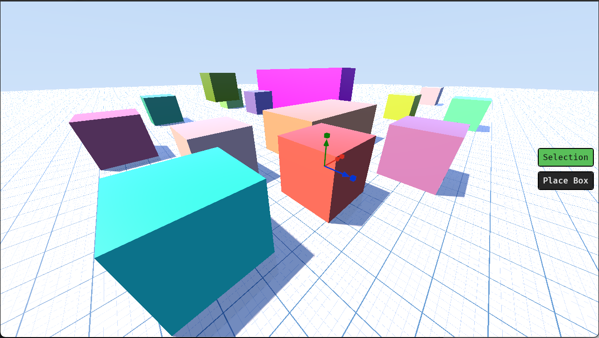

# Raystacean

An experimental Bevy + wgpu project, built to explore real-time rendering and 
building 3D geometry using signed distance fields (SDFs) and raymarching. 
Inspired by [ShapeUp](https://github.com/danielchasehooper/ShapeUp-public) and [Inigo Quilez's SDF geometry shadertoy demo](https://www.shadertoy.com/view/Xds3zN).



## Planned Features
- Ray marched renderer written in WGSL, running inside a bevy application.
- Primative support: add, move, scale, rotate primative 3d shapes in the scene.
- Constructive Solid Geometry (CSG) support: unions, subractions, intersections 
(with smooth blending).
- Lighting: simple stylistic lighting model (Blinn-Phong style) with soft shadows.
- Export: mesh export support using marching cubes.

## Roadmap
Basically my Todo list.

- [x] Support for color selection (seperate logical ID colors from display colors).
- [x] Improved UI using egui.
- [x] Rounding/smoothing box geometry.
- [x] CSG support (union, subtract, intersection) with smooth blending.
- [ ] Add more primatives (sphere, cylinder torus).
- [ ] Improved environmental lighting.
- [ ] Antialiasing grid plane.
- [ ] Export using marching cubes.

## Development

Run the project with:

```
cargo run
```

For a production build run:

```
cargo build --release
```
